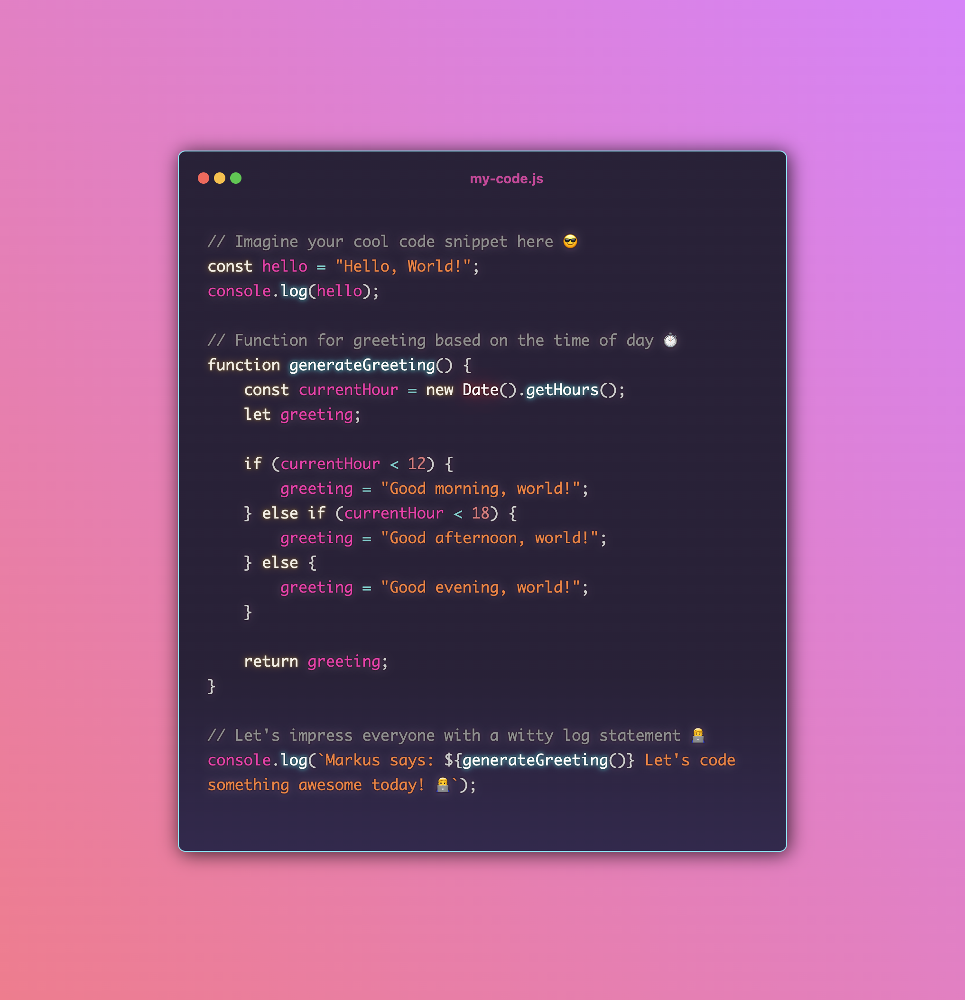

# code-snippets-in-code
An interactive code based dialogue that showcases code snippets within a stylized, macOS-like terminal window. Easy to edit with your own code and Ideal for presentations, blogs, documentation where a modern and tech-savvy aesthetic is desired

# Markus Weldon MacOS-like Code Snippet

 

TBD [Live Preview (Deployed on Vercel)](#) 

## Overview

This project showcases a MacOS-like code snippet display styled with a vibrant Synthwave '84 theme. It is a neat and visually appealing way to present code snippets on your website or portfolio. The project is structured as a single HTML file with embedded CSS styles and JavaScript code.

## Features

- **Customizable Code Snippets**: The template allows you to easily insert your own code snippets in the designated section. Features of this section include:
- **Personalized Code**: Enter your code within the `<code>` tags to have it displayed in the MacOS-like window with the Synthwave '84 theme applied.
- **Language Syntax Highlighting**: Set up your preferred language for syntax highlighting by modifying the `class` attribute in the `<pre>` and `<code>` tags. Example: `class="language-javascript"`.
- **MacOS-like Window in CSS**: A representation of a MacOS window with minimize, maximize, and close buttons.
- **Responsive Design**: The design is responsive and adjusts according to the viewport.
- **Synthwave '84 Theme**: The code snippet section styled with a Synthwave '84 theme, giving it a retro look.

## Usage

1. Clone the repository to your local machine.
2. Open the `index.html` file in a web browser to view the project.
3. Add your own code snippet to the `<code>` section of the `index.html` file.
